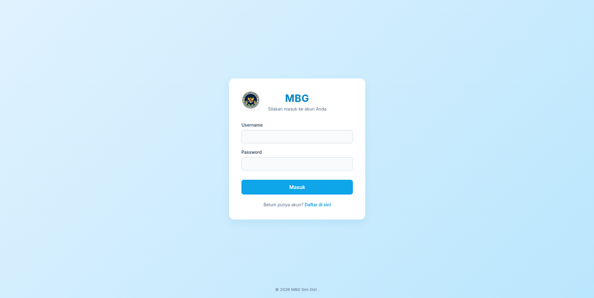
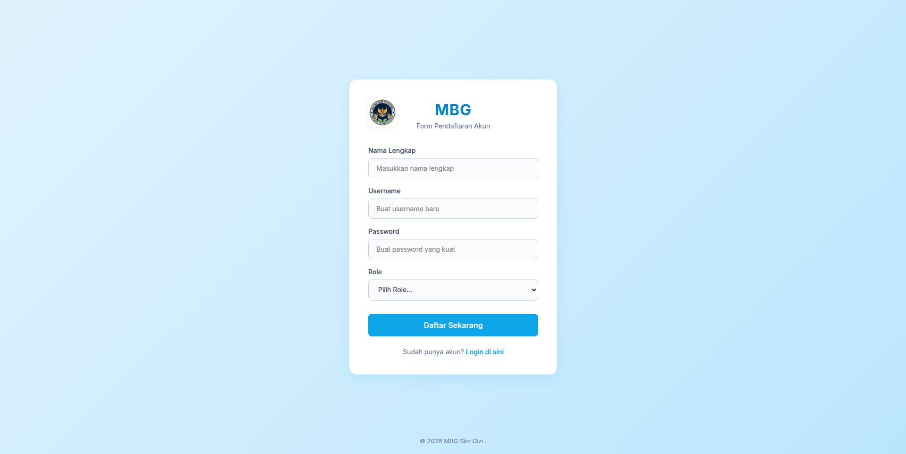
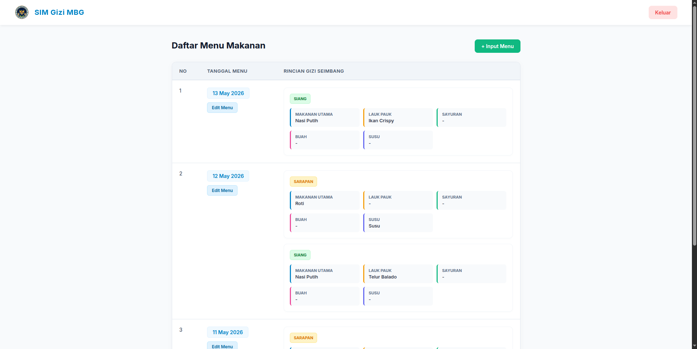
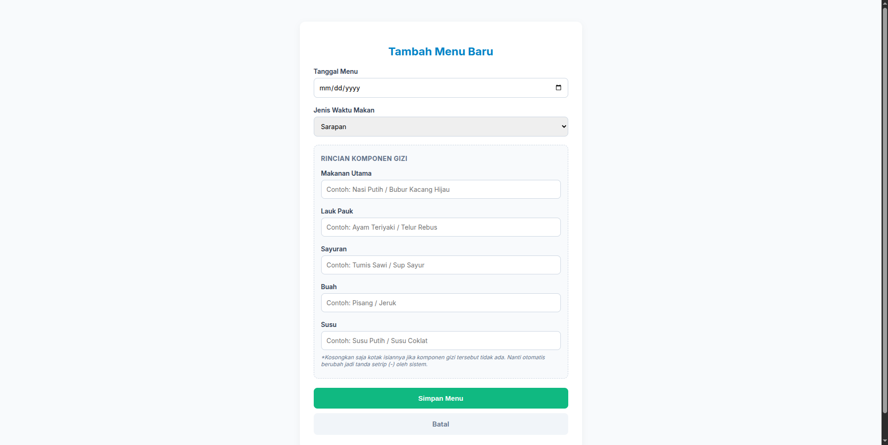

# 🍱 SIM Gizi MBG
### Sistem Informasi Manajemen Gizi — Makan Bergizi Gratis

Aplikasi berbasis web untuk mengelola data menu makanan bergizi dalam program **Makan Bergizi Gratis (MBG)**, dibangun menggunakan **PHP Native** dan **MySQL**.

---

## 📋 Deskripsi Aplikasi

**SIM Gizi MBG** adalah sistem informasi manajemen yang dirancang untuk mendukung program Makan Bergizi Gratis. Aplikasi ini memudahkan pengelolaan data menu makanan harian yang disajikan kepada penerima manfaat, mencakup informasi komponen gizi seimbang seperti makanan utama, lauk pauk, sayuran, buah, dan susu. Sistem ini dilengkapi dengan autentikasi pengguna sehingga hanya pengguna terverifikasi yang dapat mengakses dan mengelola data.

---

## ✨ Fitur Aplikasi

| Fitur | Deskripsi |
|---|---|
| 🔐 **Autentikasi** | Login & Register dengan manajemen sesi (`$_SESSION`) |
| 📋 **Manajemen Menu** | Tambah, lihat, dan edit menu makanan harian |
| 🥗 **Gizi Seimbang** | Input rincian 5 komponen gizi: Utama, Lauk, Sayur, Buah, Susu |
| 📅 **Pengelompokan Tanggal** | Menu dikelompokkan per tanggal & dibedakan Sarapan/Siang |
| 👤 **Manajemen User** | Pengelolaan akun pengguna sistem |
| 🚪 **Logout Aman** | Sesi dihancurkan saat keluar |

---

## 🚀 Cara Menjalankan Aplikasi

### Prasyarat
- **PHP** >= 7.4
- **MySQL** >= 5.7
- **Web Server**: Apache/Nginx (disarankan menggunakan XAMPP/Laragon)

### Langkah Instalasi

**1. Clone / Salin Proyek**
```bash
git clone <url-repositori>
# atau salin folder ke direktori htdocs
```

**2. Buat Database**

Buka phpMyAdmin atau MySQL CLI, lalu jalankan query berikut:

```sql
CREATE DATABASE sim_gizi;
USE sim_gizi;

-- Tabel Sekolah
CREATE TABLE sekolah (
    id_sekolah INT AUTO_INCREMENT PRIMARY KEY,
    nama_sekolah VARCHAR(150) NOT NULL,
    alamat TEXT,
    jenjang VARCHAR(20)
);

-- Tabel Penerima Manfaat
CREATE TABLE penerima_manfaat (
    id_penerima INT AUTO_INCREMENT PRIMARY KEY,
    nama VARCHAR(100) NOT NULL,
    nik VARCHAR(20) UNIQUE,
    id_sekolah INT,
    alamat TEXT,
    status VARCHAR(20),
    CONSTRAINT fk_penerima_sekolah FOREIGN KEY (id_sekolah) REFERENCES sekolah(id_sekolah) ON UPDATE CASCADE ON DELETE SET NULL
);

-- Tabel Menu Makanan
CREATE TABLE menu_makanan (
    id_menu INT AUTO_INCREMENT PRIMARY KEY,
    nama_menu VARCHAR(100) NOT NULL,
    jenis ENUM('Sarapan','Siang') NOT NULL,
    tanggal_menu DATE
);

-- Tabel Kandungan Gizi
CREATE TABLE kandungan_gizi (
    id_gizi INT AUTO_INCREMENT PRIMARY KEY,
    id_menu INT,
    kalori DECIMAL(10,2),
    protein DECIMAL(10,2),
    lemak DECIMAL(10,2),
    karbohidrat DECIMAL(10,2),
    CONSTRAINT fk_gizi_menu FOREIGN KEY (id_menu) REFERENCES menu_makanan(id_menu) ON UPDATE CASCADE ON DELETE CASCADE
);

-- Tabel Mitra
CREATE TABLE mitra (
    id_mitra INT AUTO_INCREMENT PRIMARY KEY,
    nama_mitra VARCHAR(100),
    jenis VARCHAR(50),
    alamat TEXT,
    status_verifikasi ENUM('Pending','Terverifikasi','Ditolak')
);

-- Tabel Dapur
CREATE TABLE dapur (
    id_dapur INT AUTO_INCREMENT PRIMARY KEY,
    nama_dapur VARCHAR(100),
    alamat TEXT,
    penanggung_jawab VARCHAR(100),
    kontak VARCHAR(20),
    id_mitra INT,
    CONSTRAINT fk_dapur_mitra FOREIGN KEY (id_mitra) REFERENCES mitra(id_mitra) ON UPDATE CASCADE ON DELETE SET NULL
);

-- Tabel Distribusi
CREATE TABLE distribusi (
    id_distribusi INT AUTO_INCREMENT PRIMARY KEY,
    tanggal DATE,
    id_sekolah INT,
    id_dapur INT,
    jumlah_porsi INT,
    CONSTRAINT fk_distribusi_sekolah FOREIGN KEY (id_sekolah) REFERENCES sekolah(id_sekolah) ON UPDATE CASCADE ON DELETE SET NULL,
    CONSTRAINT fk_distribusi_dapur FOREIGN KEY (id_dapur) REFERENCES dapur(id_dapur) ON UPDATE CASCADE ON DELETE SET NULL
);

-- Tabel Distribusi Detail
CREATE TABLE distribusi_detail (
    id_detail INT AUTO_INCREMENT PRIMARY KEY,
    id_distribusi INT,
    id_menu INT,
    qty INT,
    CONSTRAINT fk_detail_distribusi FOREIGN KEY (id_distribusi) REFERENCES distribusi(id_distribusi) ON UPDATE CASCADE ON DELETE CASCADE,
    CONSTRAINT fk_detail_menu FOREIGN KEY (id_menu) REFERENCES menu_makanan(id_menu) ON UPDATE CASCADE ON DELETE CASCADE
);

-- Tabel Absensi
CREATE TABLE absensi (
    id_absensi INT AUTO_INCREMENT PRIMARY KEY,
    id_penerima INT,
    tanggal DATE,
    status_hadir ENUM('Hadir','Tidak Hadir'),
    CONSTRAINT fk_absensi_penerima FOREIGN KEY (id_penerima) REFERENCES penerima_manfaat(id_penerima) ON UPDATE CASCADE ON DELETE CASCADE
);

-- Tabel Keluhan
CREATE TABLE keluhan (
    id_keluhan INT AUTO_INCREMENT PRIMARY KEY,
    id_penerima INT,
    isi_keluhan TEXT,
    tanggal DATE,
    status_keluhan ENUM('Masuk','Diproses','Selesai'),
    CONSTRAINT fk_keluhan_penerima FOREIGN KEY (id_penerima) REFERENCES penerima_manfaat(id_penerima) ON UPDATE CASCADE ON DELETE CASCADE
);

-- Tabel Petugas
CREATE TABLE petugas (
    id_petugas INT AUTO_INCREMENT PRIMARY KEY,
    nama VARCHAR(100),
    wilayah VARCHAR(100),
    nomor_hp VARCHAR(20),
    jabatan VARCHAR(50)
);

-- Tabel Penilaian Makanan
CREATE TABLE penilaian_makanan (
    id_penilaian INT AUTO_INCREMENT PRIMARY KEY,
    id_menu INT,
    nilai INT CHECK (nilai BETWEEN 1 AND 5),
    komentar TEXT,
    CONSTRAINT fk_penilaian_menu FOREIGN KEY (id_menu) REFERENCES menu_makanan(id_menu) ON UPDATE CASCADE ON DELETE CASCADE
);

-- Tabel Users
CREATE TABLE users (
    id_user INT AUTO_INCREMENT PRIMARY KEY,
    nama VARCHAR(100),
    username VARCHAR(50) UNIQUE,
    password VARCHAR(255),
    role ENUM('admin','petugas','dapur','sekolah') NOT NULL,
    created_at TIMESTAMP DEFAULT CURRENT_TIMESTAMP
);
```

**3. Konfigurasi Koneksi Database**

Buka file `koneksi.php` dan sesuaikan:
```php
$host = "localhost";
$user = "root";       // sesuaikan username MySQL Anda
$pass = "";           // sesuaikan password MySQL Anda
$db   = "sim_gizi";
```

**4. Jalankan Aplikasi**

Letakkan folder proyek di dalam `htdocs` (XAMPP) atau `www` (Laragon), lalu akses:
```
http://localhost/UTS_Php/
```

---

## 🗄️ Struktur Database

Database bernama **`sim_gizi`** terdiri dari **13 tabel** dengan relasi sebagai berikut:

```
sim_gizi
│
├── sekolah               ← Data sekolah penerima program MBG
├── penerima_manfaat      ← Siswa/peserta penerima makan bergizi
│     └── FK → sekolah
│
├── menu_makanan          ← Daftar menu harian (Sarapan / Siang)
├── kandungan_gizi        ← Nilai gizi per menu (kalori, protein, lemak, karbohidrat)
│     └── FK → menu_makanan
│
├── mitra                 ← Mitra/vendor penyedia makanan
├── dapur                 ← Dapur produksi yang dikelola mitra
│     └── FK → mitra
│
├── distribusi            ← Catatan distribusi makanan ke sekolah
│     ├── FK → sekolah
│     └── FK → dapur
│
├── distribusi_detail     ← Rincian menu dalam setiap distribusi
│     ├── FK → distribusi
│     └── FK → menu_makanan
│
├── absensi               ← Kehadiran penerima manfaat
│     └── FK → penerima_manfaat
│
├── keluhan               ← Keluhan dari penerima manfaat
│     └── FK → penerima_manfaat
│
├── petugas               ← Data petugas lapangan
├── penilaian_makanan     ← Rating & komentar menu (skala 1–5)
│     └── FK → menu_makanan
│
└── users                 ← Akun pengguna sistem (admin, petugas, dapur, sekolah)
```

### Ringkasan Tabel

| Tabel | Deskripsi |
|---|---|
| `sekolah` | Data sekolah sasaran program |
| `penerima_manfaat` | Data siswa penerima makan bergizi |
| `menu_makanan` | Menu harian (Sarapan & Siang) |
| `kandungan_gizi` | Detail nilai gizi per menu |
| `mitra` | Data mitra/vendor makanan |
| `dapur` | Data dapur produksi |
| `distribusi` | Catatan distribusi ke sekolah |
| `distribusi_detail` | Rincian item distribusi |
| `absensi` | Presensi penerima manfaat |
| `keluhan` | Pengaduan dari penerima |
| `petugas` | Data petugas lapangan |
| `penilaian_makanan` | Rating menu (1–5 bintang) |
| `users` | Akun login sistem |

---

## 📁 Struktur File Proyek

```
UTS_Php/
│
├── index.php               ← Entry point, redirect ke login
├── login.php               ← Halaman login
├── login-proses.php        ← Proses autentikasi login
├── register.php            ← Halaman registrasi akun
├── register-proses.php     ← Proses simpan data registrasi
├── logout.php              ← Proses logout & hapus sesi
│
├── menu.php                ← Dashboard utama — daftar menu makanan
├── menu-proses.php         ← Proses tambah/edit/hapus menu
├── edit-menu.php           ← Halaman edit menu per tanggal
│
├── form-user.php           ← Form pengelolaan user
├── user-proses.php         ← Proses CRUD data user
│
├── koneksi.php             ← Konfigurasi koneksi database MySQL
├── images.png              ← Logo aplikasi MBG
│
├── templates/
│   ├── form-menu.php       ← Form tambah/edit menu makanan
│   └── detail-menu.php     ← Tampilan detail menu
│
└── asset/
    ├── skrinsut1.png       ← Halaman Registrasi
    ├── skrinsut2.png       ← Dashboard Menu Makanan
    ├── skrinsut3.png       ← Form Tambah Menu
    └── skrinsut4.png       ← Halaman Login
```

---

## 📸 Screenshot Tampilan Aplikasi

### 1. Halaman Login


> Halaman autentikasi dengan desain card bersih, input username & password, serta link ke halaman registrasi.

### 2. Halaman Registrasi


> Form pendaftaran akun baru dengan field Nama Lengkap, Username, Password, dan pemilihan Role pengguna.

### 3. Dashboard Menu Makanan


> Dasbor utama yang menampilkan daftar menu harian dikelompokkan per tanggal. Setiap baris menampilkan komponen gizi seimbang (Makanan Utama, Lauk Pauk, Sayuran, Buah, Susu) dengan badge Sarapan/Siang.

### 4. Form Tambah Menu


> Form input menu baru dengan field tanggal, jenis waktu makan, dan rincian 5 komponen gizi seimbang secara terpisah.

---

## 🛠️ Teknologi yang Digunakan

| Teknologi | Keterangan |
|---|---|
| **PHP Native** | Backend & logika server-side |
| **MySQL** | Database relasional |
| **HTML5 + CSS3** | Struktur & styling antarmuka |
| **Google Fonts (Inter)** | Tipografi modern |
| **PHP Session** | Manajemen autentikasi pengguna |

---

## 👨‍💻 Informasi Proyek

- **Nama Proyek**: SIM Gizi MBG (Makan Bergizi Gratis)
- **Mata Kuliah**: Pemrograman Web (UTS)
- **Tahun**: 2026